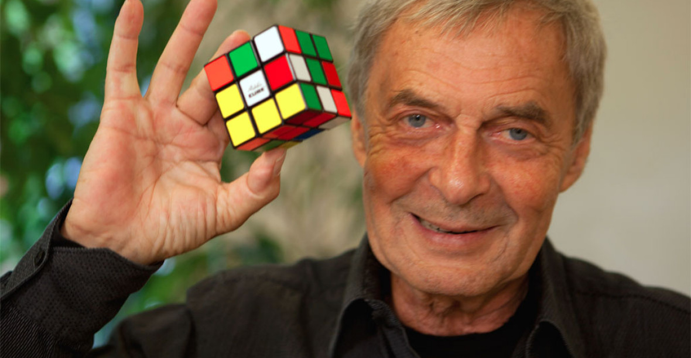

# Rubik-s-Cube

Závěrečná práce na konci 2. ročníku v předmětu WEB. Cílem je složit rubikovu kostku, a nebo se o to alespoň pokusit.

Pokud se chcete dozvědět více informací o rubikové kostce, můžete navštívit **[Wikipedii](https://cs.wikipedia.org/wiki/Rubikova_kostka)**.

V případě problémů, dotazů a nebo nápadů na vylepšení mě neváhejte kontaktovat na můj e-mail (<simon.janata.020@pslib.cz>).

